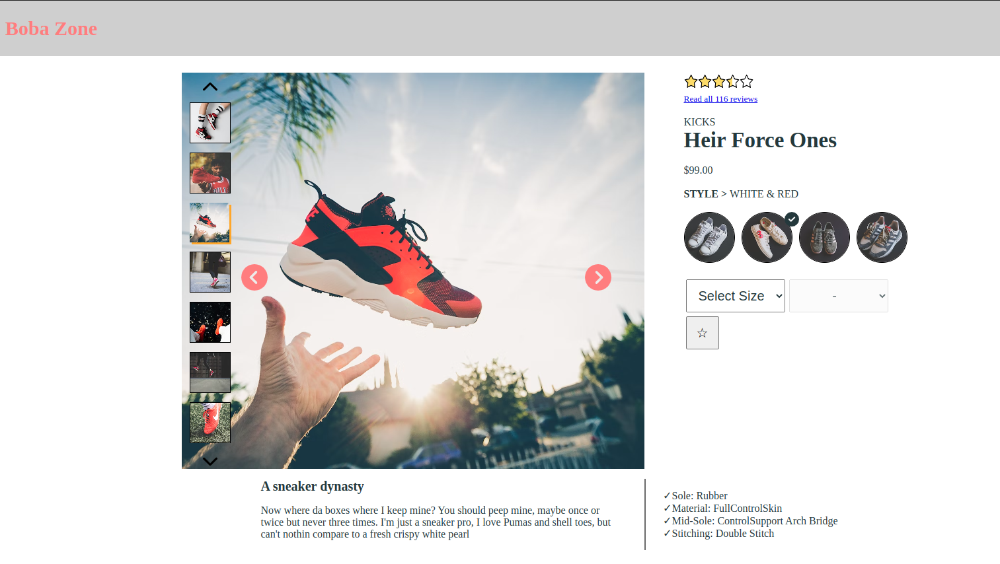
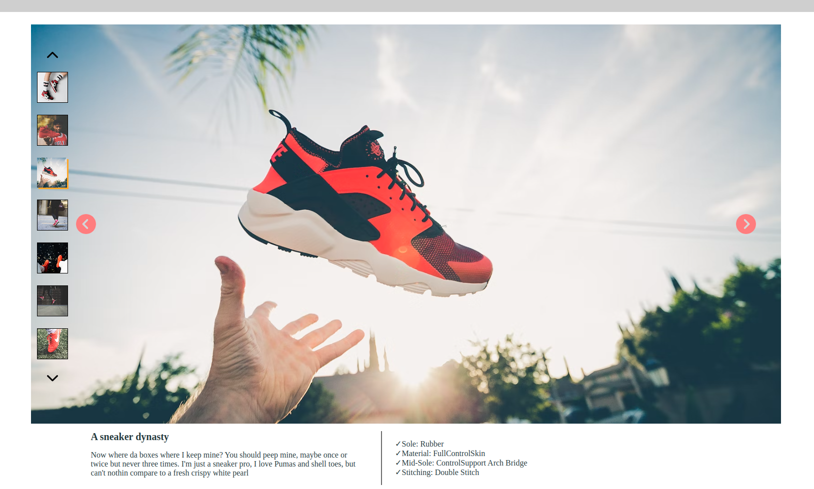
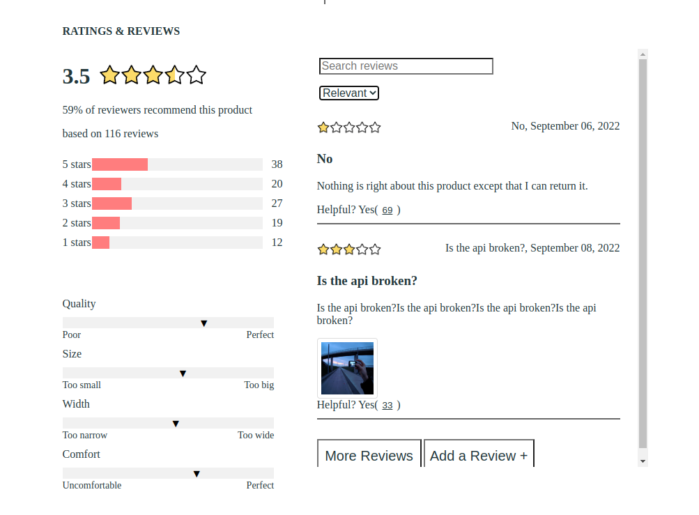
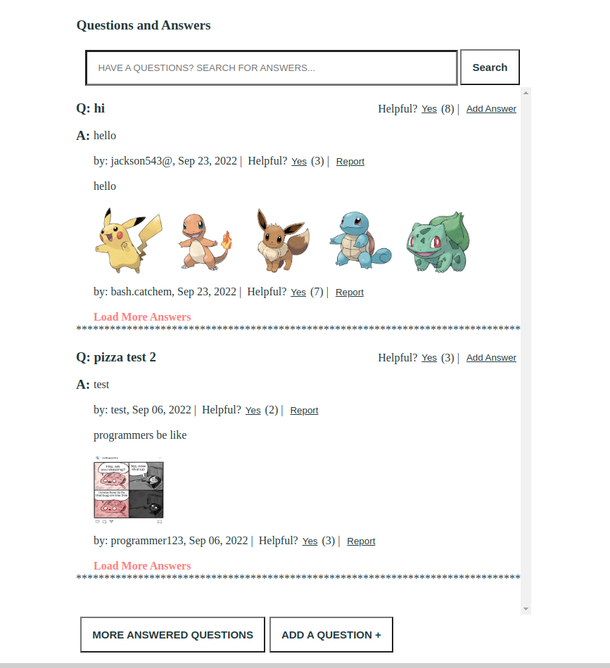
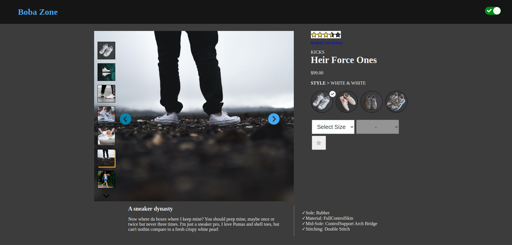

# Front End Capstone
BobaZone - Your one stop shopping site

# Description
Our e-commerce web application is designed to provide users with a comprehensive and user-friendly shopping experience. The purpose of our application is to provide customers with all the necessary information and tools to make an informed purchase decision, and to make the process of shopping as easy and convenient as possible. The main features of the application include:

# Product Information:
Users can view detailed information about a product, including a main product image, star rating, available styles, size and quantity options, an image carousel displaying different images of specific styles, and a zoom-in feature for the main product image in the gallery.

  
  

 

# Ratings and Reviews: 
Users can view customer reviews and ratings for a product, and filter them by relevancy, helpfulness, or recency. This section includes a search feature allowing users to find specific reviews.

  

 

# Question and Answer: 
Users can view a list of customer questions and answers, and mark helpful questions or report inappropriate content. Users can also search this section to find specific questions and answers.

  

 

# Dark Mode:

  

 

# Installation
npm install

# Team Members
Morgan, Nicholas, Fiona

# Contributing
cash or just buy me milktea when you ever see me

